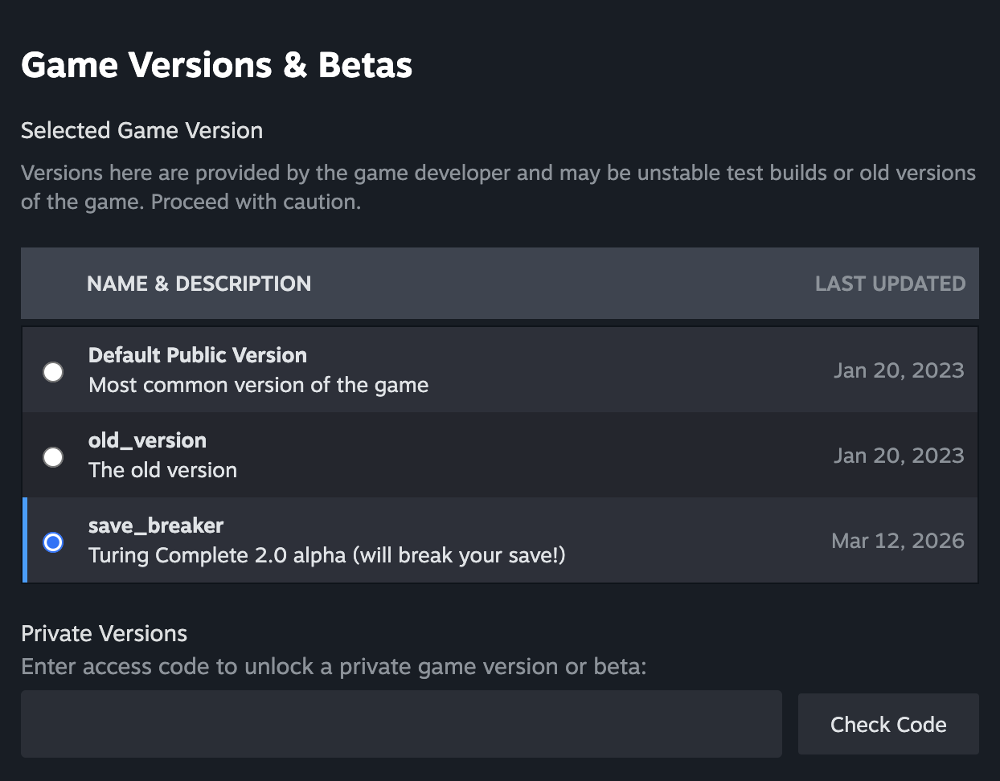

# Symphony 架构
Symphony 架构是游戏 `Turing Complete` 中的一款 CPU, 位于 `save_breaker` 分支。

作为一个 `Turing Complete` 游戏的死忠粉, 既然已经写了操作系统, 那肯定得为自己写的操作系统适配自己造的 `Symphony` 架构啦qwq~

# 致 LevelHead
感谢 `Turing Complete` 这款游戏, 同时也感谢 LevelHead.

2025年7月，高考结束的那个暑假, 我终于决定花 70 块买下这款我很早就想买的游戏, 现在想想, **这 70 块是我整个人生中最正确的一笔投资**。